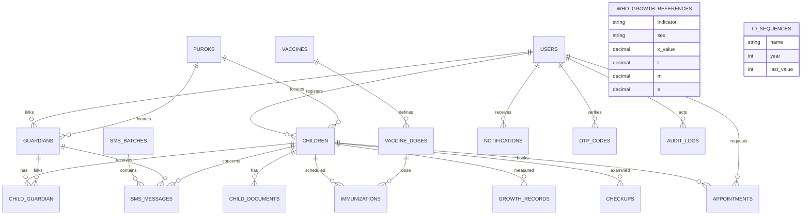

# Data model

```mermaid
erDiagram
    USERS ||--o{ GUARDIANS : links
    USERS ||--o{ CHILDREN : registers
    PUROKS ||--o{ CHILDREN : locates
    PUROKS ||--o{ GUARDIANS : locates
    CHILDREN ||--o{ CHILD_GUARDIAN : has
    GUARDIANS ||--o{ CHILD_GUARDIAN : links
    CHILDREN ||--o{ CHILD_DOCUMENTS : has
    VACCINES ||--o{ VACCINE_DOSES : defines
    CHILDREN ||--o{ IMMUNIZATIONS : scheduled
    VACCINE_DOSES ||--o{ IMMUNIZATIONS : dose
    CHILDREN ||--o{ GROWTH_RECORDS : measured
    CHILDREN ||--o{ CHECKUPS : examined
    CHILDREN ||--o{ APPOINTMENTS : books
    USERS ||--o{ APPOINTMENTS : requests
    SMS_BATCHES ||--o{ SMS_MESSAGES : contains
    GUARDIANS ||--o{ SMS_MESSAGES : receives
    CHILDREN ||--o{ SMS_MESSAGES : concerns
    USERS ||--o{ NOTIFICATIONS : receives
    USERS ||--o{ OTP_CODES : verifies
    USERS ||--o{ AUDIT_LOGS : acts
    WHO_GROWTH_REFERENCES {
      string indicator
      string sex
      decimal x_value
      decimal l
      decimal m
      decimal s
    }
    ID_SEQUENCES {
      string name
      int year
      int last_value
    }
```

The project and Shield migrations define the fields, indexes, soft-delete timestamps, and foreign keys. The Settings package owns the runtime settings table.
